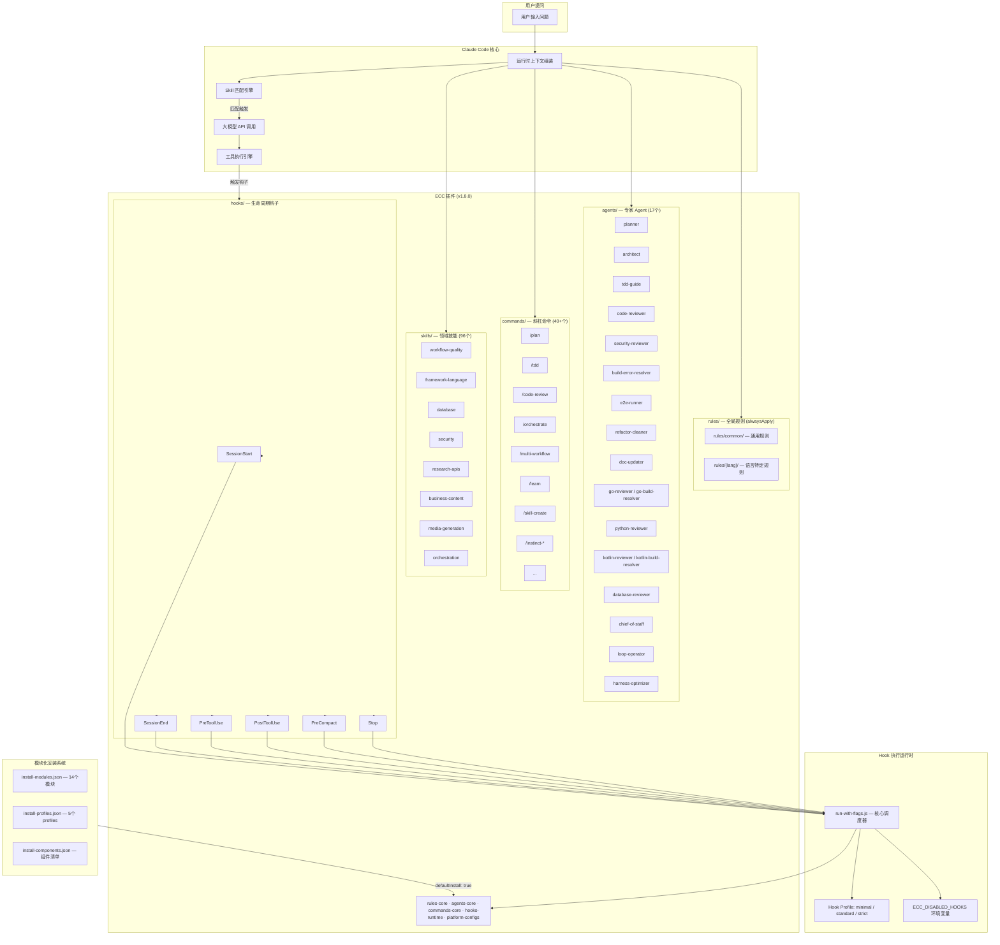
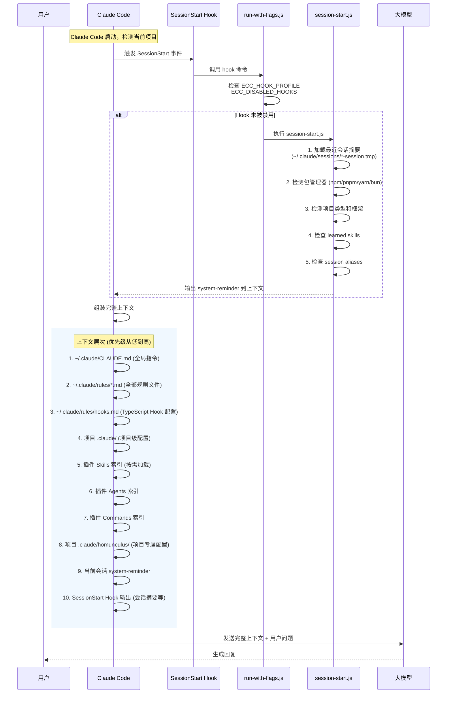
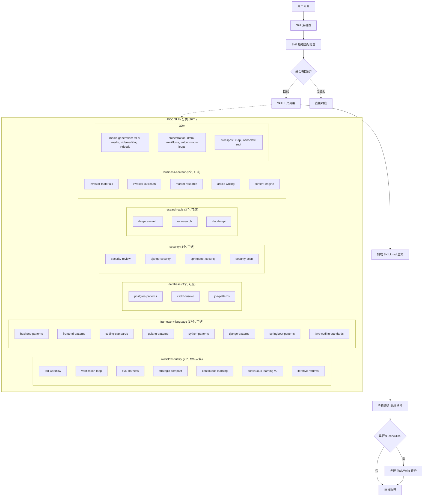
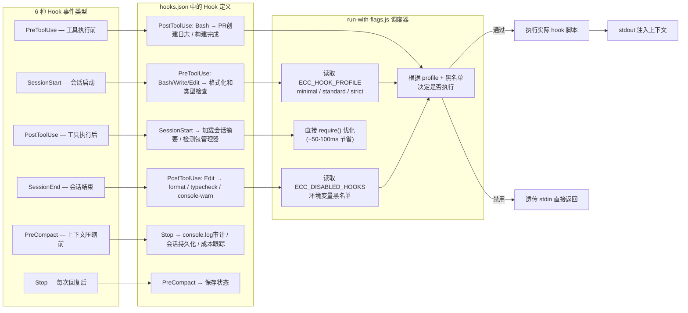
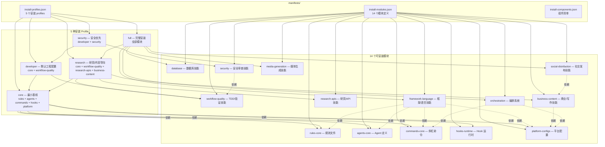
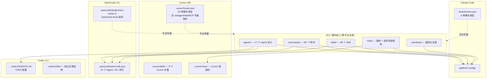
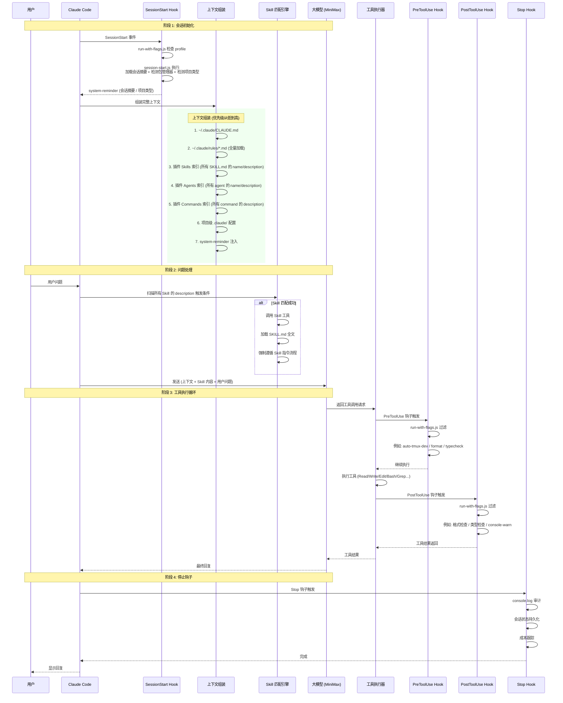

# ECC (Everything Claude Code) 插件加载机制与架构

> 基于 `everything-claude-code@1.8.0` 源码分析

---

## 一、整体架构图

---

## 二、上下文组装层次 (Session Start 流程)

---

## 三、Skill 匹配与触发机制

---

## 四、Hook 执行机制详解

---

## 五、模块化安装系统

---

## 六、多平台支持架构

---

## 七、完整请求处理流程

---

## 八、核心文件速查表

| 功能 | 文件路径 |
|------|----------|
| 插件清单 | `.claude-plugin/plugin.json` |
| 安装模块定义 | `manifests/install-modules.json` |
| 安装 profiles | `manifests/install-profiles.json` |
| Claude Code Hooks 配置 | `hooks/hooks.json` |
| Hook 核心调度器 | `scripts/hooks/run-with-flags.js` |
| SessionStart 脚本 | `scripts/hooks/session-start.js` |
| SessionEnd 脚本 | `scripts/hooks/session-end.js` |
| Hook Profile 控制 | 读取 `ECC_HOOK_PROFILE` (minimal/standard/strict) |
| Hook 黑名单 | `ECC_DISABLED_HOOKS` 环境变量 |
| Agent 定义示例 | `agents/planner.md` |
| Command 定义示例 | `commands/plan.md` |
| Skill 定义示例 | `skills/tdd-workflow/SKILL.md` |
| 通用规则 | `rules/common/*.md` |
| 语言特定规则 | `rules/{lang}/*.md` |
| OpenCode 配置 | `.opencode/opencode.json` |
| Cursor Hooks | `.cursor/hooks.json` |
| MCP 服务器配置 | `mcp-configs/mcp-servers.json` |
